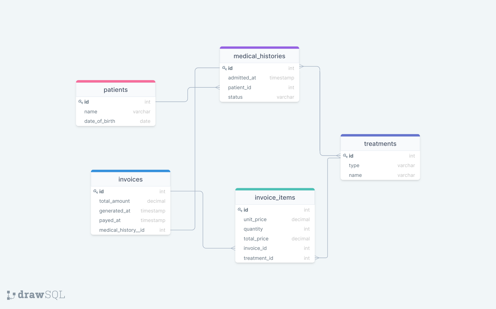
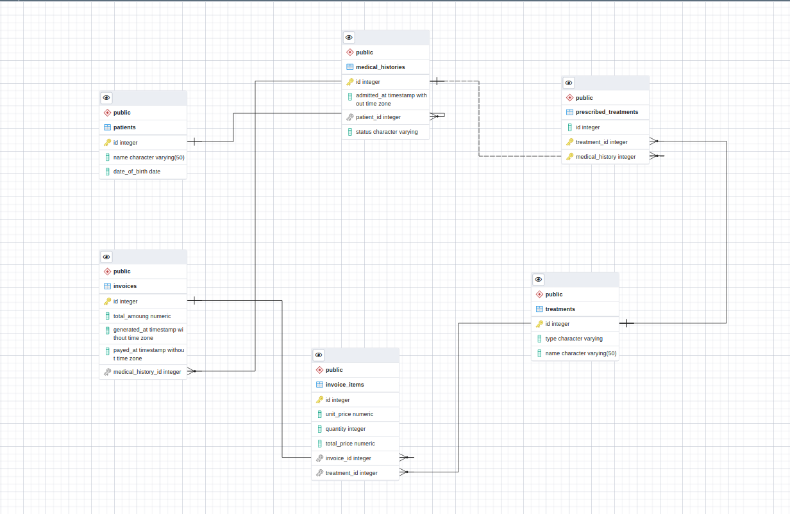

# Vet Clinic

> This repo demonstrates how to create a Postgres relational database based on a schema diagram  and store data about each patient's visit to the clinic.

## Built With

- MySQL
- git

## DB Schema Provided

## DB Schema generated from the created database

## Getting Started

This repository includes files with plain SQL that can be used to recreate a database:

- Use [schema.sql](./schema.sql) to create all tables.

## Author

👤 **Ben**

- GitHub: [Ben Kiarie](https://github.com/Benmuiruri)
- Twitter: [Optimize](https://twitter.com/_optimize)
- LinkedIn: [Ben Kiarie](https://www.linkedin.com/in/benjamin-kiarie-180b66149/)

## 🤝 Contributing

Contributions, issues, and feature requests are welcome!

Feel free to check the [issues page](https://github.com/Benmuiruri/human-clinic/issues).

## Show your support

Give a ⭐️ if you like this project!
